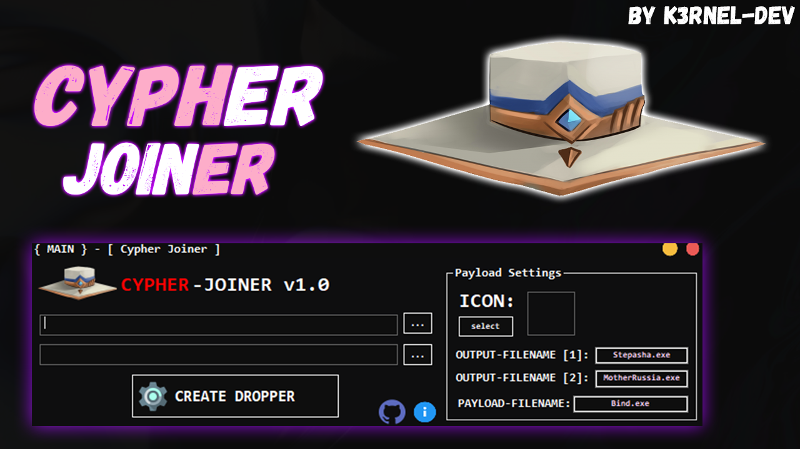
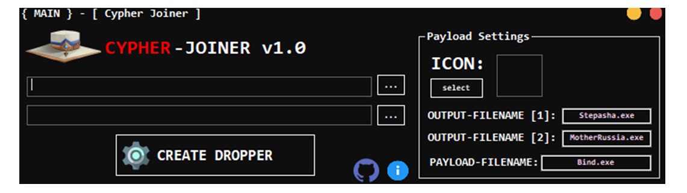

# Cypher-Joiner v1.0

## 📑 About
<b>Cypher-Joiner is a program for binding 2nd files</b>
<strong> Have a builder for creating payload.</strong>

## 💻 Screens

  

 

## How to use?
 * Select files to bind.
 * Click button and build your own payload
 * Your output payload have a name: Bind.exe

## ⚠️ Disclaimer
 * This project for education and purposes only!
 * Do not use for illegal purposes!s

## ✨ End
<strong>Thanks for watching</strong>
